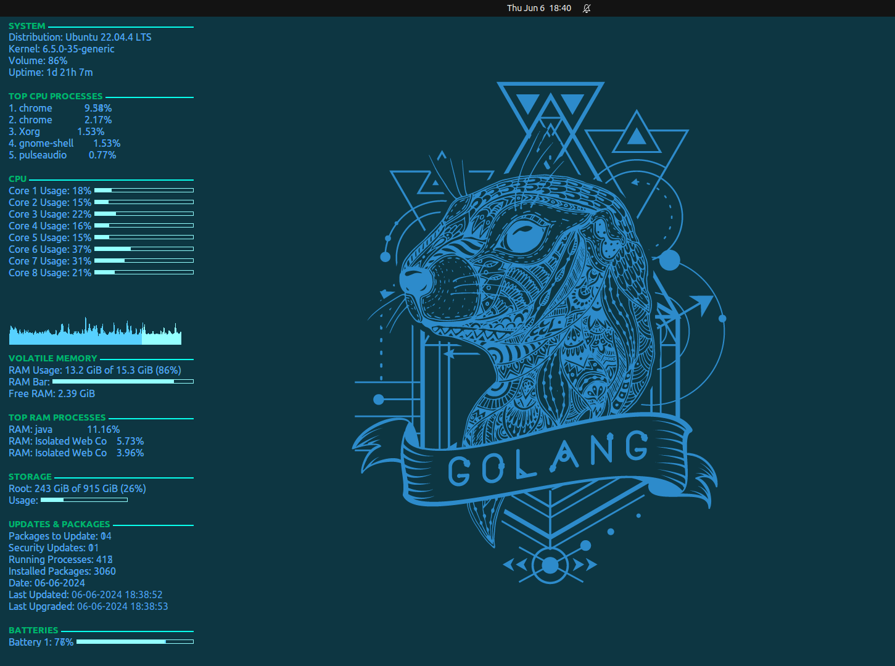
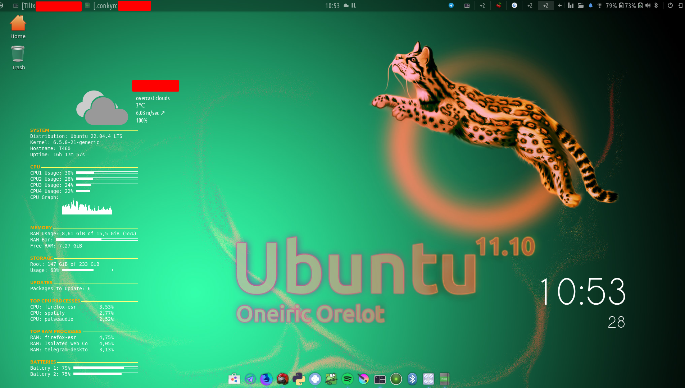

# Conky Setup for T460, Running Ubuntu 

## Update 2024
Now includes a few more new variants. Newly included Conky setups are for: x200, x61s, T60, T420. Please replace wlan0 with your actual wireless interface name if it's different. 

The CPU temperature uses the first temperature input of the first hardware monitor (hwmon 0 temp 1), which may need to be adjusted depending on your sensors setup. If you don't have lm-sensors installed, you can install it with sudo apt install lm-sensors, then run sensors-detect and follow the on-screen prompts.

lm-sensors for temperature readings: Install it with `sudo apt install lm-sensors`, then run `sensors-detect` and answer _'yes'_ to all questions.
ifconfig for network information: Typically installed by default, but if missing, install with `sudo apt install net-tools`.
wireless-tools for WiFi signal strength: Install with `sudo apt install wireless-tools`.

    sudo apt install lm-sensors
    sudo apt install acpi
    sudo apt install vnstat
    sudo apt install smartmontools
    sudo apt install vrms
Replace YOUR_CITY with your actual city name or zip code. Adjust the execi 600 part if you want to change the update frequency (600 seconds = 10 minutes).

Install amixer for volume (usually comes with ALSA utilities)
Configure lm-sensors: run sudo sensors-detect and follow prompts

## Description & Preview
This Conky setup is designed specifically for Ubuntu laptops, providing essential information at a glance. It includes system details, CPU and memory usage, storage information, pending updates, and battery status, all laid out in an easy-to-read format. I really adored the Conky setup on Puppy OS, so I felt inspired to make this.

_fig. 1, latest version as of 2024_

_fig. 2, note this is an outdated pic_

## Features
- Display system information: Distribution, Kernel, Hostname, Uptime.
- Monitor CPU usage: Individual core usage, overall CPU graph.
- Track memory usage: Used and free RAM, visual bar representation.
- Check storage details: Used space on root, percentage used, and visual representation.
- Update notifications: Count of packages that can be upgraded.
- Process monitoring: Top processes by CPU and RAM usage.
- Battery status: Display percentage and visual bar for two batteries.

## Installation
1. Install Conky on your Ubuntu laptop using `sudo apt install conky-all`.
2. Copy the `.conkyrc` configuration file to your home directory.
3. Run Conky with the command `conky` to start monitoring.

## Additional Requirements
To ensure all features work correctly, you may need to install additional fonts or tools:
- Ubuntu fonts are used for headers, and DejaVu Sans Mono is used for body text. Ensure these are installed on your system.
- For battery and CPU temperature monitoring, ensure that `acpi` and `lm-sensors` are installed. Use `sudo apt-get install acpi lm-sensors` and configure sensors with `sudo sensors-detect`.

## Usage
To launch Conky with this configuration, simply run `conky` from the terminal. You can add Conky to your startup applications to have it launch automatically on login.

## Customization
Feel free to customize the `.conkyrc` file to your liking. You can adjust the colors, fonts, and what information is displayed. 

## Notes
- This setup has been optimized for a 1920x1080 (16:9) screen resolution.
- Tested on a T460 Ubuntu laptop, but it should work on other models with similar specs.
- It assumes a dual-battery setup; modify accordingly if your laptop has a different battery configuration.

## License
This Conky setup is released under the GNU General Public License v3.0. 

## Project status
Will change colors eventually.

